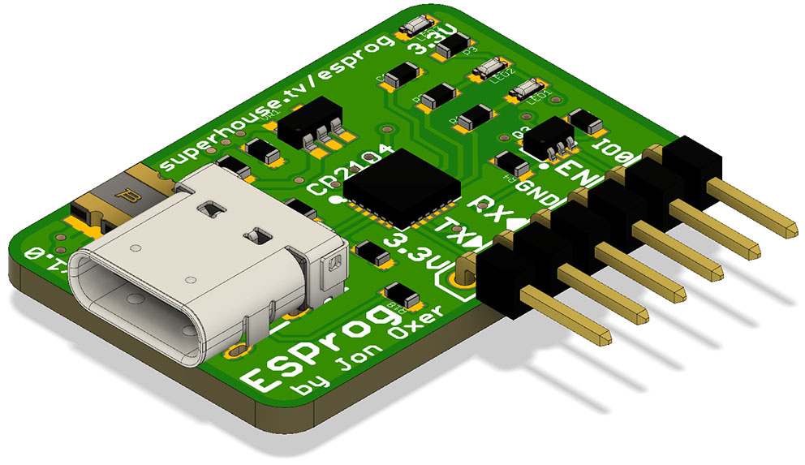

ESP8266 / ESP32 Programmer
===========================
Copyright 2019 SuperHouse Automation Pty Ltd  www.superhouse.tv  

Serial programming adapter for the Espressif ESP8266 and ESP32 with
a USB-C connection. Provides a 6-pin connection that includes power,
TX, RX, and the GPIO0 / Reset lines required to put the ESPx into
programming mode.

You can view more details at:

  http://www.superhouse.tv/esprog

INSTALLATION
------------
The design is saved as an EAGLE project. EAGLE PCB design software is
available from www.cadsoftusa.com free for non-commercial use. To use
this project download it and place the directory containing these files
into the "eagle" directory on your computer. Then open EAGLE and
navigate to the project.

CREDITS
-------
Jonathan Oxer jon@oxer.com.au

DISTRIBUTION
------------
The specific terms of distribution of this project are governed by the
license referenced below.

LICENSE
-------
Licensed under the TAPR Open Hardware License (www.tapr.org/OHL).
The "license" folder within this repository also contains a copy of
this license in plain text format.
