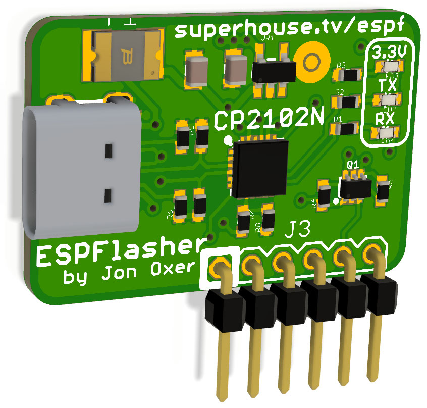

ESPFlasher ESP8266 / ESP32 Programmer
======================================

Serial programming adapter for the Espressif ESP8266 and ESP32 with
a USB-C connection. Provides a 6-pin connection that includes power,
TX, RX, and the GPIO0 / Reset lines required to put the ESPx into
programming mode.

The pinout is compatible with the "ESPFlash" header convention:

  https://www.superhouse.tv/espflash

Features:

 * USB-C interface for connection to host.
 * ESPFlash 1x6 0.1" header for connection to target board.
 * CP2102N USB-to-serial converter.
 * TX/RX LEDs.
 * 600mA 3.3V voltage regulator to power target board.

You can view more details at:

  https://www.superhouse.tv/espf

Credits
-------
 * Jonathan Oxer <jon@oxer.com.au>

License
-------
Copyright 2019-2020 Superhouse Automation Pty Ltd www.superhouse.tv

The hardware portion of this project is licensed under the TAPR Open
Hardware License (www.tapr.org/OHL). The "license" folder within this
repository also contains a copy of this license in plain text format.

The software portion of this project is licensed under the Simplified
BSD License. The "licence" folder within this project contains a copy
of this license in plain text format.
